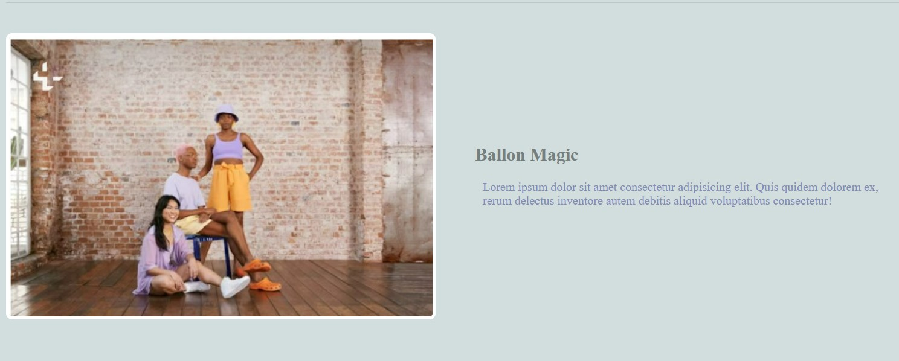

# Multicolumn

# this project focused in multiple grid its mde with HTML and CSS

# main class it has grid column and it has 3 columns with equal width the follows css parts shows all the above description 
.grid-container {
  display: grid;
  grid-template-columns: 1fr 1fr 1fr;
  gap: 60px;
  margin: 20px auto;
  max-width: 1200px;
}

# featured class inside the article has grid inside the grid
# the second grid it has two column with equal width
article.featured {
  grid-column: span 3;
  display: grid;
  grid-template-columns: 1fr 1fr;
  gap: 60px;
  align-items: center;
  border-bottom: 1px solid #bbc7c7;
  padding-bottom: 60px;
}
# the above css gives the below image 

# CopyRight @Bisrat 2024